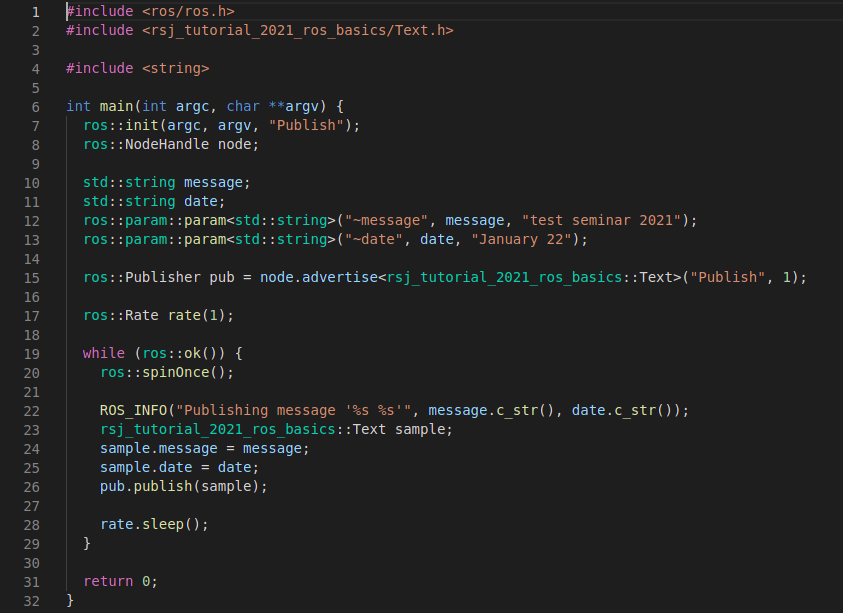

# ROSの基本操作

- Table of contents
{:toc}

基本的なROS上で動くプログラムの書き方とコンパイル方法を学習します。

下記の実習を行うために、まず`ROS_MASTER_URI`と`ROS_HOSTNAME`を`localhost`に戻します（[参照](./linux_and_ros_install.md#ネットワーク構成)）。


## 基本的な用語

パッケージ
: ノードや設定ファイル、コンパイル方法などをまとめたもの

ノード
: ROSの枠組みを利用して動作する実行ファイル

メッセージ
: ノード間でやりとりするデータ

トピック
: ノード間でメッセージをやりとりする際にメッセージを格納する場所

ノード、メッセージ、トピックの関係は以下の図のように表せます。


基本的に、ソフトウェアとしてのROSはノード間のデータのやりとりをサポートするための枠組みです。<br>
加えて、使い回しがきく汎用的なノードを世界中のROS利用者で共有するコミュニティも大きな意味でのROSの一部となっています。

## ソースコードを格納するワークスペース

ROSでは、プログラムをビルドする際にcatkinというソフトウェアパッケージを使用しています。<br>
また、catkin は、 cmake というソフトウェアを使っており、ROS用のプログラムのパッケージ毎にcmakeの設定ファイルを作成することで、
ビルドに必要な設定を行います。

以下の手順で本作業用の新しいワークスペースを作ります。
```shell
$ mkdir -p ~/catkin_ws/src
$ cd ~/catkin_ws/src
$ catkin_init_workspace
Creating symlink "/home/[ユーザ名]/catkin/src/CMakeLists.txt"
    pointing to "/opt/ros/kinetic/share/catkin/cmake/toplevel.cmake"
$ ls
CMakeLists.txt
$ cd ..
$ ls
src
$
```

*今回はROSをインストールするために`install_ros_kinetic.sh`を利用しましたのでワークスペースが自動的に作成されました。*{: style="color: red"}
```shell
cd ~/catkin_ws/src
```

`catkin_ws`ディレクトリ内にある、`build`、`devel`は、catkinシステムがプログラムをビルドする際に使用するものなので、
ユーザが触る必要はありません。<br>
`catkin_ws/src`ディレクトリは、ROSパッケージのソースコードを置く場所で、中にある`CMakeLists.txt` は、
ワークスペース全体をビルドするためのルールが書かれているファイルです。

このディレクトリに、本作業用のパッケージをダウンロードします。

```shell
$ cd ~/catkin_ws/src
$ git clone https://github.com/igra9/rsj_seminar_2021_ros_basics.git
$ ls
CMakeLists.txt  rsj_seminar_2021_ros_basics
$
```

gitは、ソースコードなどの変更履歴を記録して管理する分散型バージョン管理システムと呼ばれるものです。<br>今回のセミナーでは詳細は触れませんが、研究開発を行う上では非常に有用なシステムですので、利用をお勧めします。<br>公式の解説書、[Pro Git](https://git-scm.com/book/ja/v2")などを参考にして下さい。

GitHubは、ソースコードなどを格納、保管、管理するためのWebリポジトリサービスです。<br>
オープンソースソフトウェアの開発、共同作業および配布のためによく利用されており、
ROSではソースコードの保存と配布する場所としてもっとも人気なサービスとなっています。<br>
バイナリパッケージとして配布されているROSパッケージ以外の利用をする場合、GitHubを利用します。<br>
URLが分かれば上の手順だけで簡単にROSのパッケージが自分のワークスペースにインポートし利用することができます。

では、次にパッケージのディレクトリ構成を確認します。<br>
ダウンロードしているパッケージがバージョンアップされている場合などには、下記の実行例とファイル名が異なったり、ファイルが追加・削除されている場合があります。

```shell
$ cd ~/catkin_ws/src/rsj_seminar_2021_ros_basics/
$ ls
CMakeLists.txt  launch  msg  package.xml  src
$ ls launch/
test.launch
$ ls msg/
Text.msg
$ ls src/
Publish.cpp  Show.cpp
$
```

`CMakeLists.txt`と`package.xml`には、使っているライブラリの一覧や生成する実行ファイルとC++のソースコードの対応など、
このパッケージをビルドするために必要な情報が書かれています。<br>
`launch`ディレクトリには、複数のノードでできたシステムの定義が、`msg`ディレクトリには、このパッケージ独自のデータ形式の定義が、`src`ディレクトリには、このパッケージに含まれるプログラム(ノード)のソースコードが含まれています。

`catkin_make`コマンドで、ダウンとロードした`rsj_seminar_2021_ros_basics`パッケージを含む、ワークスペース全体をビルドします。`catkin_make`は、ワークスペースの最上位ディレクトリ(`~/catkin_ws/`)で行います。

## ROSノードの理解とビルド・実行

先作成したワークスペースを利用します。<br>
ターミナルを開き、パッケージが正しく存在しているか確認します。

```shell
$ cd ~/catkin_ws/src/
$ ls
CMakeLists.txt  rsj_seminar_2021_ros_basics
$ cd ..
$
```

ソースファイルの編集にはお好みのテキストエディタが利用可能です。<br>
Linuxでのプログラム開発がはじめての方には、Ubuntuにデフォルトでインストールされている`gedit`がおすすめです。
プログラミング作業が多い方には`Visual Code`がおすすめです。

お好みのテキストエディタで`~/catkin_ws/src/rsj_seminar_2021_ros_basics/src/Publish.cpp`を開きます。



### 送信ノードの作成 （基本的なコードを読み解く）

このコードが実行されたときの流れを確認しましょう。

まず、先頭部分では、必要なヘッダファイルをインクルードしています。

```c++
#include <ros/ros.h>
```

続いて、本ノードが利用するメッセージのヘッダファイルをインクルードしています。

```c++
#include <rsj_seminar_2021_ros_basics/Text.h>
```

`std::string`が利用されるので、ヘッダファイルをインクルードします。

```c++
#include <string>
```

続いて、C++のmain関数が定義されています。<br>
本ノードは非常に簡単な構成としているため、すべての機能をmain関数に入れています。<br>
複雑な機能や色々なデータを持つノードには、クラスとしての実装することをおすすめします。

```c++
int main(int argc, char **argv) {
  ros::init(argc, argv, "Publish");
  ros::NodeHandle node;

  std::string message;
  std::string date;
  ros::param::param<std::string>("~message", message, "test seminar 2021");
  ros::param::param<std::string>("~date", date, "January 22");

  ros::Publisher pub = node.advertise<rsj_seminar_2021_ros_basics::Text>("Publish", 1);

  ros::Rate rate(1);

  while (ros::ok()) {
    ros::spinOnce();

    ROS_INFO("Publishing message '%s %s'", message.c_str(), date.c_str());
    rsj_seminar_2021_ros_basics::Text sample;
    sample.message = message;
    sample.date = date;
    pub.publish(sample);

    rate.sleep();
  }

  return 0;
}
```

`main`関数は、まずノードのセットアップを行います。

`ros::init`はROSのインフラストラクチャの初期設定を行いノードを初期化します。<br>
1、2番目の引数には、main関数の引数をそのまま渡し、3番目の引数には、このノードの名前(この例では"Greeter")を与えています。

その次にある`ros::NodeHandle node`は、ノードを操るための変数を初期化します。

次の４行はパラメータの初期化です。ROSでは、純粋コマンドラインを利用するよりROSのパラメータ機能を利用することが標準的です。<br>
こうすることで、コマンドラインだけではなくて、roslaunch（複数のノードを起動するためのツール）やGUIツールからもパラメータの設定が簡単にできます。

パラメータの初期化が終わったら、データ送信のためのパブリッシャーを初期化します。<br>
この変数の作成によりトピックが作成され、__このノードからデータの送信が可能になります。__{: style="color: red" } <br>
以下の引数を与えています。

`"Publish"`
: トピック名：データをこのトピックに送信する

`1`
: メッセージのバッファリング量を指定 (大きくすると、処理が一時的に重くなったときなどに受け取り側の読み飛ばしを減らせる)

advertise関数についている`<rsj_seminar_2021_ros_basics::Text>`の部分はメッセージの型を指定しています。<br>
(この指定方法は、C++のテンプレートという機能を利用していますが、ここでは「`advertise`のときはメッセージの型指定を`<>`の中に書く」とだけ覚えておけば問題ありません)

セットアップの最後として、`ros::Rate rate(1)`で周期実行のためのクラスを初期化しています。<br>
初期化時の引数で実行周波数(この例では1 Hz)を指定します。

`while(ros::ok())`で、メインの無限ループを回します（すなわちこのノードのメーンプロセッシングループです）。<br>
`ros::ok()`を`while`の条件にすることで、ノードの終了指示が与えられたとき(`Ctrl+c`{: style="border: 1px solid black" } が押された場合も含む)には、ループを抜けて終了処理などが行えるようになっています。

ループ中では、まず、_`ros::spinOnce()`を呼び出して、ROSのメッセージを受け取る_{: style="color: red" } といった処理を行います。<br>
`spinOnce`は、その時点で届いているメッセージの受け取り処理を済ませた後、すぐに処理を返します。<br>
`rate.sleep()`は、先ほど初期化した実行周波数を維持するように`sleep`します。

`ros::spinOnce()`と`rate.sleep()`の間に本ノードの処理を入れました。

最初は、ROSでログ情報を画面などに出力する際に用いるROS_INFO()関数を呼び出してメッセージを表示しています。<br>
他にも、ROS_DEBUG()、ROS_WARN()、ROS_ERROR()、ROS_FATAL()などのデバッグログ関数が用意されています。

その後、データを送信します。<br>
まずは送信するデータ型（`rsj_seminar_2021_ros_basics::Text`）を初期化し、値を設定します。<br>
さきほどセットアップで作成したパラメータの値を利用します。<br>
こうすることで、送信されるデータの内容は実行するときに自由に変更できます。

そして、`pub.publish(sample)`によってデータを送信します。<br>
この行でデータはバッファーに入れられ、別のスレッドが自動的にサブスクライバに送信します(ROSのデフォルトでは非同期送信となります）。

main ループが終了すると作成した変数は自動的にクリーンアップを実行し、ノードのシャットダウンを行います。

### ビルド＆実行

ROS パッケージをビルドするためには、`catkin_make`コマンドを用います。

下記コマンドをターミナルで実行してみましょう。

```shell
$ cd ~/catkin_ws/
$ catkin_make
```

ROSシステムの実行の際、ROSを通してノード同士がデータをやりとりするために用いる「roscore」を起動しておく必要があります。<br>
2つ目のターミナルを開き、それぞれで以下を実行して下さい。

1つ目のターミナルで下記を実行します。

```shell
$ roscore
```

ROSでワークスペースを利用するとき、ターミナルでそのワークスペースに環境変数などを設定することが必要です。<br>
このためにワークスペースの最上位のディレクトリで`source devel/setup.bash`を実行します。<br>
このコマンドはワークスペースの環境編情報などを利用中のターミナルに読み込みます。<br>
しかし、 ターミナルごとに環境変数はリセットされますので、新しいターミナルでワークスペースを利用しはじめるときには、まず`source devel/setup.bash`を実行しなければなりません。<br>
一つのターミナルで一回だけ実行すれば十分です。そのターミナルを閉じるまで有効となります。<br>
この作業を省略するため、`.bashrc`に`source devel/setup.bash`を追加することをおすすめします。
*`install_ros_kinetic.sh`を利用した場合は`.bashrc`に`source devel/setup.bash`が既に追加されました。*{: style="color: red"}

2つ目のターミナルで下記を実行します。

```shell
$ cd ~/catkin_ws/
$ rosrun rsj_seminar_2021_ros_basics publish
[ INFO] [1494840089.900580884]: Publishing message 'test seminar 2021 January 22'
```

上記のようなログが表示されれば成功です。

ソースコードにパラメータを利用したので、コマンドラインからパラメータ設定を試してみましょう。<br>
ノードを実行した2つ目のターミナル（__注意：`roscore`のターミナルではなくて__{: style="color: red" } ）に `Ctrl+c`{: style="border: 1px solid black" } を入力してノードを終了します。<br>
そして以下を実行してください。

```shell
$ rosrun rsj_seminar_2021_ros_basics publish \
  _message:=test-2 _date:=today
[ INFO] [1494840247.644756809]: Publishing message 'test-2 today'
```

上記のようなログが表示されれば成功です。

実行後は両方のターミナルで `Ctrl+c`{: style="border: 1px solid black" } でノードと`roscore`を終了します。

### 受信ノードの作成

前節で作成したノードはメッセージを送信するノードでした。<br>
次にメッセージを受信するノードを作成してみましょう。

以下のソースは`rsj_seminar_2021_ros_basics/src/Show.cpp`ファイルにあります。

```c++
#include <ros/ros.h>
#include <rsj_seminar_2021_ros_basics/Text.h>

#include <iostream>

void callback(const rsj_seminar_2021_ros_basics::Text::ConstPtr &msg) {
  std::cout << msg->message << " " << msg->date << '\n';
}

int main(int argc, char **argv) {
  ros::init(argc, argv, "Show");
  ros::NodeHandle node;

  ros::Subscriber sub = node.subscribe("Publish", 10, callback);

  ros::spin();

  return 0;
}
```

本ノードは`Publish`というトピックから取得したデータをターミナルに表示します。<br>
`Publish`からの差は以下のようです。

まずは`callback`関数です。<br>
この関数はトピックのデータ型に合っているポインタを引数としてもらいます。<br>
トピックからデータを受け取ったら、`callback`関数は呼ばれます。<br>
そのデータを`std::cout`に出力し終了します。

`const rsj_seminar_2021_ros_basics::Text::ConstPtr` は、const型(内容を書き換えられない)、`rsj_seminar_2021_ros_basics`パッケージに含まれる、`Text`型のメッセージの、const型ポインタを表しています。<br>
`&msg`の`&`は、参照型(内容を書き換えられるように変数を渡すことができる)という意味ですが、(const型なので)ここでは特に気にする必要はありません。<br>
msgはクラスへのポインタなので「-&gt;」を用い、以降はクラスのメンバ変数へのアクセスなので「.」を用いてアクセスしています。

`main`関数内にパラメータの初期化はなくなりました。本ノードはパラメータを利用しません。

`ros::Publisher`の初期化もなくなり、代わりに`ros::Subscriber`を初期化します。<br>
この行はトピックへのアクセスを初期化し、データが取得したらの対応を示します。<br>
引数は以下です。

`"Publish"`
: トピック名

`10`
: バッファーサイズ

`callback`
: メッセージを受け取ったときに呼び出す関数を指定 (`callback`関数)

最後に、main ループでの処理は不要となります。<br>
本ノードはデータが届くとき以外何もしないので、無限ループになる`ros::spin()`を呼びます。<br>
`ros::spin()`は`Publish`の`while(...)`と`ros::spinOnce()`と類似の機能を中で持つので、ノードがシャットダウンされるまでに戻りません。

### 実行

作成したノードを実行してみましょう。<br>
1つ目のターミナルで以下を実行します。

```shell
$ roscore
```

そして2つ目のターミナルで以下を実行します。

```shell
$ cd ~/catkin_ws/
$ rosrun rsj_seminar_2021_ros_basics publish
[ INFO] [1494840089.900580884]: Publishing message 'test seminar 2021 January 22'
```

最後に、3番目のターミナルを開いて、下記を実行します。

```shell
$ cd ~/catkin_ws/
$ rosrun rsj_seminar_2021_ros_basics show
```

「test seminar 2021 January 22」と表示されれば成功です。

以上の手順で、ROSパッケージに含まれるノードのソースコードを編集し、ビルドして、実行できるようになりました。

## システムとして実行する

`roslaunch`を利用して、複数のノードでできたシステムを開始、終了することができます。

手動でノードを１ノードずつ起動することは面倒ですし、ミスを誘発する可能性も高まります。<br>
そのためにROSに`roslaunch`というツールがあります。<br>
`roslaunch`を利用すると、システム全体をまとめて起動し、状況をモニターし、そしてまとめて終了することが可能となります。

### launchファイルを読み解く

launchファイルは、ノードやパラメータの組み合わせを定義するためのファイルです。<br>
フォーマットはXMLです。<br>
システムに含まれるノードとそのノードの起動方法を一つずつ定義します。

`rsj_seminar_2021_ros_basics`パッケージに以下のファイルが`launch/test.launch`として存在します。<br>
このファイルはさきほど手動で起動したシステムを定義します。

```xml
<launch>
  <node name="publisher" pkg="rsj_seminar_2021_ros_basics" type="publish">
    <param name="message" value="Test seminar"/>
    <param name="date" value="January 22"/>
  </node>

  <node name="show" pkg="rsj_seminar_2021_ros_basics" type="show" output="screen"/>
</launch>
```

`node`タグは２つあります。<br>
属性は下記の通りです。

`name`
: ノードインスタンスの名

`pkg`
: ノードを定義するパッケージ名

`type`
: ノードの実行ファイル名

`output`
: `stdout`の先：定義しないと`stdout`（`ROS_INFO`や`std::cout`への出力等）はターミナルで表示されず、`~/.ros/log/`に保存されるログファイルだけに出力される。

１番目の`<node>`は`publish`ノードの定義です。<br>
本要素の中でパラメータの設定も行っています。<br>
なお、パラメータの設定を行わない場合はノードのソースに定義したディフォルト値が利用されるので、記述は必須ではありません。

２番目の`<node>`は`show`ノードの定義です。<br>
パラメータはありませんが、出力されることをターミナルで表示するようにします。

### roslaunchでシステムを起動

開いているターミナルに`roscore`や起動中のノードをすべて `Ctrl+c`{: style="border: 1px solid black" } で停止します。<br>
その後、いずれか１つのターミナルで以下を実行します。

```shell
$ cd ~/catkin_ws
$ roslaunch rsj_seminar_2021_ros_basics test.launch
... logging to /home/user_name/.ros/log/40887b56-395c-11e7-b8
68-d8cb8ae35bff/roslaunch-user_name-11087.log
Checking log directory for disk usage. This may take awhile.
Press Ctrl-C to interrupt
Done checking log file disk usage. Usage is <1GB.

started roslaunch server http://localhost:43427/

SUMMARY
========

PARAMETERS
 * /publisher/date: January 22
 * /publisher/message: Test seminar
 * /rosdistro: kinetic
 * /rosversion: 1.12.7

NODES
  /
    publisher (rsj_seminar_2021_ros_basics/publish)
    show (rsj_seminar_2021_ros_basics/show)

auto-starting new master
process[master]: started with pid [13161]
ROS_MASTER_URI=http://localhost:11311

setting /run_id to 40887b56-395c-11e7-b868-d8cb8ae35bff
process[rosout-1]: started with pid [13161]
started core service [/rosout]
process[publisher-2]: started with pid [13166]
process[show-3]: started with pid [13179]
Test seminar January 22
Test seminar January 22
```

「Test seminar January 22」が繰り返して表示されたら成功です。

`Ctrl+c`{: style="border: 1px solid black" } でシステムを停止します。

```shell
Test seminar January 22
Test seminar January 22
Test seminar January 22
[Ctrl+c]
^C[show-3] killing on exit
[publisher-2] killing on exit
[rosout-1] killing on exit
[master] killing on exit
shutting down processing monitor...
... shutting down processing monitor complete
done
$
```

これでシステムの起動、停止が簡単にできるようになりました。

`roslaunch`を利用する場合は、別のターミナルでの`roscore`の実行は不要です。<br>
`roslaunch`は中で`roscore`を起動したり停止したりします。

<button type="button" class="bth btn-primary btn-lg">[
    <span style="color:black">**メインページへ**</span>](/index.html)</button>
<button type="button"  class="bth btn-success btn-lg">
    [<span style="color:black">**次の実習へ**</span>](/turtlebot-basics.html)</button>