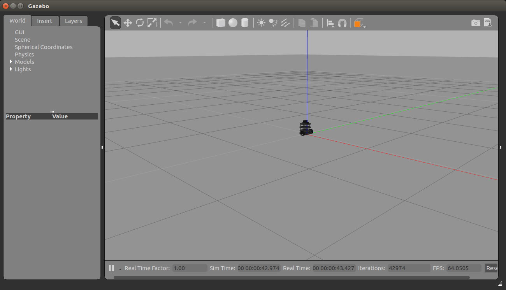
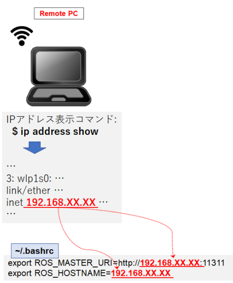
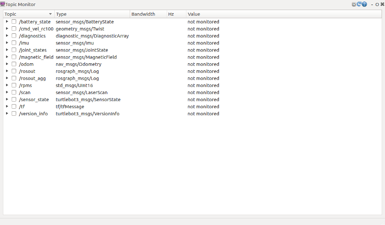
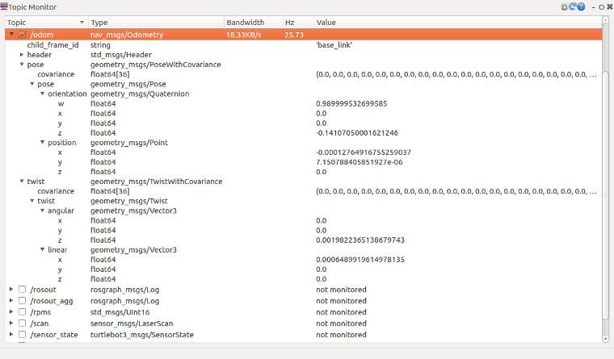
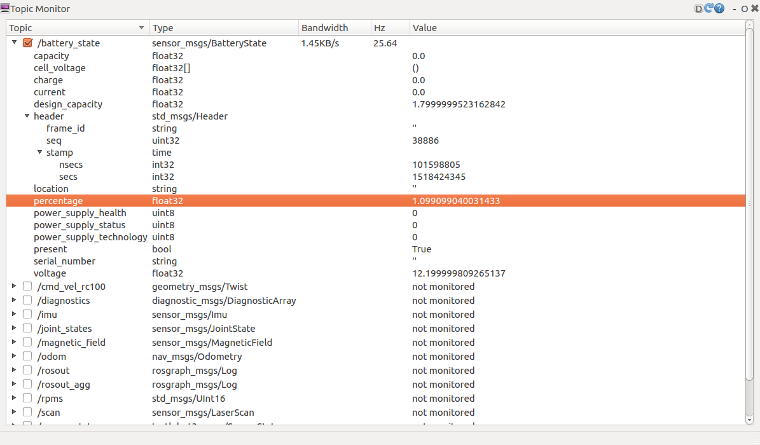
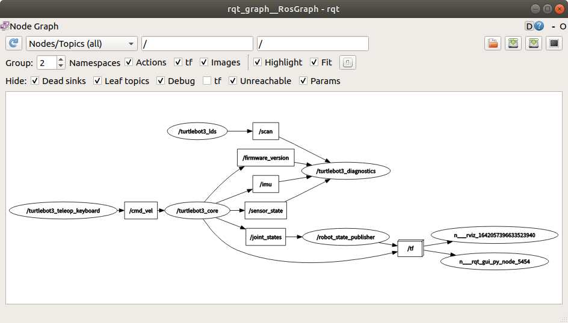

# 移動ロボットの動作確認

- Table of contents
{:toc}

基本的なROS上で移動ロボットの操作方法を学習します。

***TurtleBot3のモデル名を指定する必要があります。***

**`【リモートPCで実施】`**
``` bash
$ echo "export TURTLEBOT3_MODEL=burger" >> ~/.bashrc
$ source ~/.bashrc
```

## シミュレーションでTurtleBot3を操作

***シミュレーション環境をインストールします。***

**`【リモートPCで実施】`**
```shell
$ cd ~/catkin_ws/src/
$ git clone -b melodic-devel https://github.com/ROBOTIS-GIT/turtlebot3_simulations.git
$ cd ..
$ catkin_make
```

***シミュレーションを起動します。***

**`【リモートPCで実施】`**
```shell
$ roslaunch turtlebot3_gazebo turtlebot3_empty_world.launch
```

PCの性能によってシミュレータを起動するのに多少時間がかかります。
下記のようなウィンドウが表示されるまで待ちましょう。



### キーボードでロボットを操作

TurtleBot3は、さまざまな機器での遠隔操作が可能です。PS3、 Xbox360、 ROBOTIS RC100などの無線機器で動作確認をしています。

簡易的な遠隔操作のテストを行うために`turtlebot3_teleop_key`ノードを起動します。

***新しいターミナルウィンドウを開き、以下のコマンドを入力します。***

**`【リモートPCで実施】`**
``` bash
$ roslaunch turtlebot3_teleop turtlebot3_teleop_key.launch
```

ノードの起動に成功すると、ターミナルウィンドウに以下のようなコマンドが表示されます。

``` bash
  Control Your Turtlebot3!
  ---------------------------
  Moving around:
          w
     a    s    d
          x

  w/x : increase/decrease linear velocity
  a/d : increase/decrease angular velocity
  space key, s : force stop

  CTRL-C to quit
```

***シミュレータの画面を見ながらそれぞれのキーを押してロボットがどう動くか確認しましょう。***

***シミュレータと`turtlebot3_teleop_key`を起動したターミナルで`Ctrl+c`{: style="border: 1px solid black" }を押すとプログラムが終了します。***


## 実際のTurtleBot3を操作

***下記の実習を行うために、まず`ROS_MASTER_URI`と`ROS_HOSTNAME`の`localhost`をリモートPCのIPアドレスに変更します。(下図参照)***




***さきほど修正した設定を反映するため、以下を実行します。 (~/.bashrcの修正により、今後、新規にターミナルを開いた時は自動で設定が反映されます)***

**`【リモートPCで実施】`**
``` bash
$ source ~/.bashrc
```

### TurtleBotをリモートPCで表示

<div style="counter-reset: h1 6"></div>


**警告**：
1. TurtleBot3側のPC上で roscore を **実行しないでください。**
2. 各デバイスのIPアドレスが正しく設定されているかどうかを確認してください。
3. バッテリー電圧が11V以下になるとブザーアラームが鳴り続け、アクチュエータが作動しなくなります。ブザーアラームが鳴った場合は、バッテリーを充電する必要があります。

<div class="notice--warning">{{ notice_01 | markdownify }}</div>


#### roscoreの実行

**注釈**：ターミナルアプリは、画面左上の"Activities"から検索することが出来ます。ターミナルのショートカットキーは、`Ctrl+Alt+t`{: style="border: 1px solid black" }です。
{: .notice--info}

***リモートPCで roscoreを実行します。***

**`【リモートPCで実施】`**
``` bash
$ roscore
```

#### TurtleBot3を起動

TurtleBot3のアプリケーションを起動するための基本的なパッケージを起動します。

***新しいターミナルウィンドウを開き、TurtleBot3の制御コンピュータ(SBC)にログインします。***

**`【リモートPCで実施】`**
```shell
$ ssh ubuntu@192.168.YY.YY (The IP 192.168.YY.YY is your Raspberry Pi’s IP or hostname)
```
パスワードは**turtlebot**です。(変更している場合は適宜読み替えてください)

下記のような表示があれば接続は成功です。

**`【リモートPCで実施】`**
```shell
$ ssh ubuntu@192.168.YY.YY
ubuntu@192.168.YY.YY’s password:

...

Last login: [曜日] [月] [日] XX:XX:XX 2022 from 192.168.XX.XX
$
```
***SBCへのログイン後、以下を実行します。***

**`【リモートPCからログインしたSBCで実施】`**
``` bash
$ roslaunch turtlebot3_bringup turtlebot3_robot.launch
```

以下のようなメッセージが表示されます。
(IPアドレスなどは環境によって異なる可能性があります)

もし、メッセージが全く表示されない場合は、リモートPCおよび、SBCの`ROS_MASTER_URI`、`ROS_HOSTNAME`のIPアドレス設定が正しいか確認ください。

```shell
SUMMARY
========

PARAMETERS
 * /rosdistro: melodic
 * /rosversion: 1.14.10
 * /turtlebot3_core/baud: 115200
 * /turtlebot3_core/port: /dev/ttyACM0
 * /turtlebot3_core/tf_prefix:
 * /turtlebot3_lds/frame_id: base_scan
 * /turtlebot3_lds/port: /dev/ttyUSB0

NODES
  /
    turtlebot3_core (rosserial_python/serial_node.py)
    turtlebot3_diagnostics (turtlebot3_bringup/turtlebot3_diagnostics)
    turtlebot3_lds (hls_lfcd_lds_driver/hlds_laser_publisher)

ROS_MASTER_URI=http://192.168.1.2:11311

process[turtlebot3_core-1]: started with pid [14198]
process[turtlebot3_lds-2]: started with pid [14199]
process[turtlebot3_diagnostics-3]: started with pid [14200]
[INFO] [1531306690.947198]: ROS Serial Python Node
[INFO] [1531306691.000143]: Connecting to /dev/ttyACM0 at 115200 baud
[INFO] [1531306693.522019]: Note: publish buffer size is 1024 bytes
[INFO] [1531306693.525615]: Setup publisher on sensor_state [turtlebot3_msgs/SensorState]
[INFO] [1531306693.544159]: Setup publisher on version_info [turtlebot3_msgs/VersionInfo]
[INFO] [1531306693.620722]: Setup publisher on imu [sensor_msgs/Imu]
[INFO] [1531306693.642319]: Setup publisher on cmd_vel_rc100 [geometry_msgs/Twist]
[INFO] [1531306693.687786]: Setup publisher on odom [nav_msgs/Odometry]
[INFO] [1531306693.706260]: Setup publisher on joint_states [sensor_msgs/JointState]
[INFO] [1531306693.722754]: Setup publisher on battery_state [sensor_msgs/BatteryState]
[INFO] [1531306693.759059]: Setup publisher on magnetic_field [sensor_msgs/MagneticField]
[INFO] [1531306695.979057]: Setup publisher on /tf [tf/tfMessage]
[INFO] [1531306696.007135]: Note: subscribe buffer size is 1024 bytes
[INFO] [1531306696.009083]: Setup subscriber on cmd_vel [geometry_msgs/Twist]
[INFO] [1531306696.040047]: Setup subscriber on sound [turtlebot3_msgs/Sound]
[INFO] [1531306696.069571]: Setup subscriber on motor_power [std_msgs/Bool]
[INFO] [1531306696.096364]: Setup subscriber on reset [std_msgs/Empty]
[INFO] [1531306696.390979]: Setup TF on Odometry [odom]
[INFO] [1531306696.394314]: Setup TF on IMU [imu_link]
[INFO] [1531306696.397498]: Setup TF on MagneticField [mag_link]
[INFO] [1531306696.400537]: Setup TF on JointState [base_link]
[INFO] [1531306696.407813]: --------------------------
[INFO] [1531306696.411412]: Connected to OpenCR board!
[INFO] [1531306696.415140]: This core(v1.2.1) is compatible with TB3 Burger
[INFO] [1531306696.418398]: --------------------------
[INFO] [1531306696.421749]: Start Calibration of Gyro
[INFO] [1531306698.953226]: Calibration End
```


**ヒント**：LiDARセンサ、Raspberry Pi Camera、Intel® RealSense™ R200、もしくはコアを別々に起動したい場合は、以下のコマンドを使用してください。
  - $ roslaunch turtlebot3_bringup turtlebot3_lidar.launch
  - $ roslaunch turtlebot3_bringup turtlebot3_rpicamera.launch
  - $ roslaunch turtlebot3_bringup turtlebot3_realsense.launch
  - $ roslaunch turtlebot3_bringup turtlebot3_core.launch


<div class="notice--info">{{ bringup_tip_01 | markdownify }}</div>

**注釈**：ターミナルウィンドウに`lost sync with device`というエラーメッセージが表示された場合は、TurtleBot3 のセンサデバイスが正しく接続されていない可能性があります。
{: .notice--info}

#### Rviz上でTurtleBot3をロードする

**リモートPCで** robot state publisherとRVizを実行します。

***新しいターミナルウィンドウを開き、以下のコマンドを入力します。***

**`【リモートPCで実施】`**
``` bash
$ roslaunch turtlebot3_bringup turtlebot3_remote.launch
```

***新しいターミナルウィンドウを開き、以下のコマンドを入力します。***

**`【リモートPCで実施】`**
```bash
$ rosrun rviz rviz -d `rospack find turtlebot3_description`/rviz/model.rviz
```


### キーボードでロボットを操作


**注釈**：
- この例は、リモートPCでの動作を想定しています。

<div class="notice--info">{{ notice_01 | markdownify }}</div>

**警告**：この例を実行する前に、必ず[Bringup](#turtlebot3を起動)コマンドを実行してください。また、テーブルの上でロボットをテストする際には、ロボットが落下してしまう可能性があるため、注意してください。
{: .notice--warning}

シミュレーションと同様に`turtlebot3_teleop_key`ノードを起動します。

***リモートPCで新しいターミナルウィンドウを開き、以下のコマンドを入力します。***

**`【リモートPCで実施】`**
``` bash
$ roslaunch turtlebot3_teleop turtlebot3_teleop_key.launch
```

ノードの起動に成功すると、ターミナルウィンドウに以下のようなコマンドが表示されます。

``` bash
  Control Your Turtlebot3!
  ---------------------------
  Moving around:
          w
     a    s    d
          x

  w/x : increase/decrease linear velocity
  a/d : increase/decrease angular velocity
  space key, s : force stop

  CTRL-C to quit
```

***ロボットを床においてrvizの画面とロボットを確認しながらキーボードでロボットを動かしてみましょう。***

動作確認が終わりましたら一旦全てのノードを終了させます。

***下記のコマンドで`roscore`以外のノードを終了させることができます。***

**`【リモートPCで実施】`**
```shell
$ rosnode kill -a
```

`roscore`を終了させるのに`roscore`を起動しているターミナルで`Ctrl+c`{: style="border: 1px solid black" }を押します。
下記のような表示があれば`roscore`が終了したことが確認できます。

```shell
^C[rosout-1] killing on exit
[master] killing on exit
shutting down processing monitor ...
... shutting down processing monitor complete
done
$
```

***TurtleBot3のアプリケーションを起動するために開いたターミナルで`exit`を記入し、`Enter`{: style="border: 1px solid black" }キーを押すと接続を切断します。***

**`【リモートPCからログインしたSBCで実施】`**
```shell
$ exit
$  (リモートPCのシェル)
```

---
### ご参考
rosノードが実行中にTopicを可視化するツールを紹介します。デバッグなどに役立ちます。

#### Topicのモニタ
TurtleBot3のトピックを確認するために、ROSが提供するrqtを使用します。
rqtはすべてのトピックを表示することで、トピックのステータスを簡単に確認できるようにするツールです。

***`roscore`が動作していることを確認後、以下のコマンドを使用して、リモートPCからrqtを実行します。***

トピックモニターウィンドウが表示されない場合は、`plugin`{: style="border: 1px solid black" }->`Topics`{: style="border: 1px solid black" }->`Topic Monitor`{: style="border: 1px solid black" }を選択します。

**`【リモートPCで実施】`**
```shell
$ rqt
```
(起動時にターミナルにERRORが表示されることがありますが、rqtは起動するようです)

前項のようにTurtlebot3が動作している場合、以下のような表示になります。



トピックモニターが起動しても、トピック値はモニターされません。各トピックの横にあるチェックボックスをクリックして、トピックのモニターを開始します。


より詳細なトピックメッセージを表示するには、チェックボックスの横にあるアイコン▶をクリックします。



例えば、`/battery_state`{: style="border: 1px solid black" }は、現在のバッテリー電圧や残量など、バッテリーの状態を表示します。



このようにrqtでトピックを表示することで、デバッグなどへの活用が可能となります。

#### Topicとノードの関係

TurtleBot3のトピックとノードの関係を可視化するには、rqt_graphを使用します。
rqt_graphは各ノードがpublish/subscribeするトピックをグラフ表示します。

***`roscore`が動作していることを確認後、以下のコマンドを使用してリモートPCからrqt_graphを実行します。***

各ノードとトピックの関係が表示されない場合は、左上のコンボボックスから、`Nodes/Topics(all)`を選択します。

**`【リモートPCで実施】`**
```shell
$ rqt_graph
```
(起動時にターミナルにERRORが表示されることがありますが、rqt_graphは起動するようです)

<br>

以下のように、ノードは円、トピックは矩形に囲まれて表示されます。



<button type="button" class="bth btn-primary btn-lg">[
    <span style="color:black">**メインページへ**</span>](index.html)</button>
<button type="button"  class="bth btn-success btn-lg">
    [<span style="color:black">**次の実習へ**</span>](slam-basics.html)</button>
